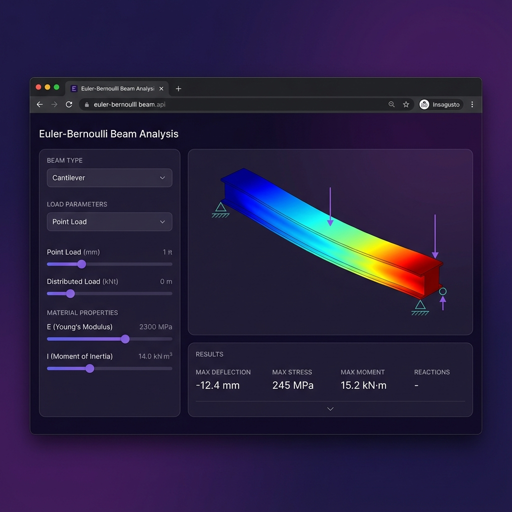

# Euler-Bernoulli Beam Analysis

An interactive 3D web application for structural beam analysis based on classical Euler-Bernoulli beam theory. This educational tool provides real-time visualization and computation of beam deflection, bending moment, shear force, and stress distribution.




## Table of Contents

- [Overview](#overview)
- [Theoretical Background](#theoretical-background)
- [Features](#features)
- [Capabilities](#capabilities)
- [Limitations](#limitations)
- [Installation](#installation)
- [Usage](#usage)
- [Project Structure](#project-structure)
- [Technical Implementation](#technical-implementation)
- [References](#references)

## Overview

This application implements the Euler-Bernoulli beam equation for structural analysis, providing engineers and students with an intuitive tool to visualize beam behavior under various loading conditions. The 3D visualization powered by Three.js allows for interactive exploration of deformed beam shapes with stress coloring.

## Theoretical Background

### Euler-Bernoulli Beam Equation

The governing differential equation for beam deflection:

```
EI · d⁴w/dx⁴ = q(x)
```

Where:

- **E** = Young's modulus (elastic modulus) [Pa]
- **I** = Second moment of area (moment of inertia) [m⁴]
- **w** = Transverse deflection [m]
- **q(x)** = Distributed load intensity [N/m]

### Key Assumptions

The Euler-Bernoulli theory is based on the following assumptions:

1. **Small deflections**: The beam deflection is small compared to its length
2. **Plane sections remain plane**: Cross-sections perpendicular to the neutral axis remain plane after deformation
3. **Linear elastic material**: The material follows Hooke's Law (σ = Eε)
4. **Negligible shear deformation**: Shear deformation effects are ignored
5. **Prismatic beam**: Constant cross-section along the length

### Derived Quantities

| Quantity | Formula | Description |
|----------|---------|-------------|
| Slope | θ = dw/dx | Rotation of cross-section |
| Bending Moment | M = -EI · d²w/dx² | Internal moment |
| Shear Force | V = -EI · d³w/dx³ | Internal shear |
| Bending Stress | σ = My/I | Normal stress at distance y from neutral axis |

## Features

### Beam Types

- **Simply Supported Beam**: Pin support at one end, roller at the other
- **Fixed-Fixed (Clamped) Beam**: Both ends rigidly fixed
- **Cantilever Beam**: One end fixed, other end free

### Load Types

- **Point Load**: Concentrated force at a specified location
- **Uniformly Distributed Load (UDL)**: Constant load intensity along the entire span
- **Applied Moment**: Concentrated moment at a specified location

### Visualization

- Real-time 3D beam rendering with Three.js/WebGL
- Interactive orbit controls (rotate, zoom, pan)
- Stress distribution color mapping (blue → green → yellow → red)
- Support and load indicator symbols
- 2D diagrams for deflection, moment, and shear

### Materials

- Structural Steel (E = 200 GPa)
- Aluminum Alloy (E = 70 GPa)
- Copper (E = 120 GPa)
- Timber (E = 12 GPa)
- Custom material option

## Capabilities

✅ **What This Application CAN Do:**

| Capability | Description |
|------------|-------------|
| Static Analysis | Compute deflection, slope, moment, and shear for static loads |
| Multiple Beam Types | Analyze simply supported, fixed-fixed, and cantilever configurations |
| Multiple Load Types | Handle point loads, distributed loads, and applied moments |
| 3D Visualization | Interactive WebGL-based beam visualization with orbit controls |
| Stress Visualization | Display stress intensity via color gradient mapping |
| Real-time Updates | Instant recalculation when parameters change |
| Rectangular Cross-sections | Analyze beams with rectangular (solid) cross-sections |
| Custom Materials | Define custom elastic modulus values |
| Diagram Generation | Plot deflection, moment, and shear diagrams |
| Educational Use | Clear visualization for teaching structural mechanics |

## Limitations

❌ **What This Application CANNOT Do:**

| Limitation | Description |
|------------|-------------|
| Dynamic Analysis | No support for dynamic/vibration analysis or moving loads |
| Non-linear Materials | Only linear elastic (Hookean) material behavior |
| Large Deflections | Invalid for deflections exceeding ~10% of beam length |
| Shear Deformation | Timoshenko beam effects not included (important for short, deep beams) |
| Complex Cross-sections | Only rectangular sections; no I-beams, T-beams, or hollow sections |
| Multiple Loads | Only one load type at a time; no load combinations |
| Thermal Effects | No thermal expansion or temperature gradient analysis |
| Buckling Analysis | No stability or buckling calculations |
| Continuous Beams | No multi-span continuous beam analysis |
| Plastic Analysis | No yielding or plastic hinge formation |
| 3D Loading | Only 2D bending in one plane; no biaxial bending or torsion |
| Fatigue Analysis | No cyclic loading or fatigue life prediction |
| FEA Integration | Closed-form solutions only; no finite element meshing |

### Validity Range

The Euler-Bernoulli theory is most accurate when:

- **Span-to-depth ratio (L/h) > 10** - For shorter beams, use Timoshenko theory
- **Maximum deflection < L/100** - For larger deflections, use non-linear analysis
- **Stress < Yield strength** - Material must remain in elastic range

## Installation

No installation required. Simply clone or download the repository and open the HTML file in a modern web browser.

```bash
# Clone the repository
git clone https://github.com/your-username/euler-bernoulli-beam.git

# Navigate to the project directory
cd euler-bernoulli-beam

# Open in browser (Linux/macOS)
xdg-open index.html  # Linux
open index.html      # macOS

# Or simply double-click index.html in your file manager
```

### Requirements

- Modern web browser with WebGL support (Chrome, Firefox, Edge, Safari)
- No server required - runs entirely client-side
- JavaScript must be enabled

## Usage

1. **Select Beam Type**: Choose from simply supported, fixed-fixed, or cantilever
2. **Select Load Type**: Choose point load, distributed load, or applied moment
3. **Set Material**: Select a predefined material or enter custom elastic modulus
4. **Define Geometry**: Enter beam length, width, and height
5. **Set Load Parameters**: Define load magnitude and position
6. **Click "Analyze Beam"**: View results in the visualization panel

### 3D Controls

| Action | Mouse/Keyboard |
|--------|----------------|
| Rotate view | Left-click + drag |
| Zoom | Scroll wheel |
| Pan | Right-click + drag |
| Reset view | Click 🎯 button |

## Project Structure

```
euler-bernoulli-beam/
├── index.html              # Main HTML document
├── style.css               # Styling with dark theme and glassmorphism
├── README.md               # This documentation file
└── js/
    ├── app.js              # Main application controller
    ├── beam-calculator.js  # Euler-Bernoulli calculation engine
    └── visualization.js    # Three.js 3D visualization module
```

## Technical Implementation

### Calculation Engine (`beam-calculator.js`)

Implements closed-form solutions for beam deflection, slope, moment, and shear based on singularity functions and superposition principles.

**Key Methods:**

- `analyze(params)` - Main analysis function returning arrays of values along the beam
- `simplySupported(x, L, EI, ...)` - Solutions for simply supported beams
- `fixedFixed(x, L, EI, ...)` - Solutions for fixed-fixed beams
- `cantilever(x, L, EI, ...)` - Solutions for cantilever beams

### Visualization Module (`visualization.js`)

Uses Three.js for WebGL-accelerated 3D rendering with:

- Custom geometry generation for deformed beam shape
- Vertex coloring for stress visualization
- OrbitControls for interactive navigation
- Dynamic support and load indicator meshes

### Application Controller (`app.js`)

Handles:

- UI event binding and parameter collection
- Calculation invocation and result distribution
- 2D canvas diagram rendering
- Result formatting and display

## References

1. Hibbeler, R.C. (2017). *Mechanics of Materials* (10th ed.). Pearson.
2. Beer, F.P., Johnston, E.R., DeWolf, J.T. (2015). *Mechanics of Materials* (7th ed.). McGraw-Hill.
3. Timoshenko, S.P., Gere, J.M. (1972). *Mechanics of Materials*. Van Nostrand Reinhold.
4. Gere, J.M., Goodno, B.J. (2018). *Mechanics of Materials* (9th ed.). Cengage Learning.

## License

This project is licensed under the MIT License - see the [LICENSE](LICENSE) file for details.

---

**Note**: This application is intended for educational purposes and preliminary analysis only. For professional structural engineering applications, please use certified analysis software and consult with a licensed structural engineer.
